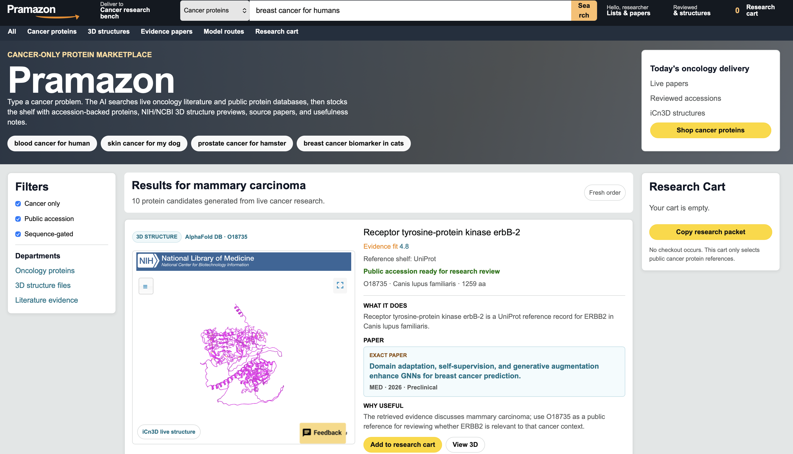
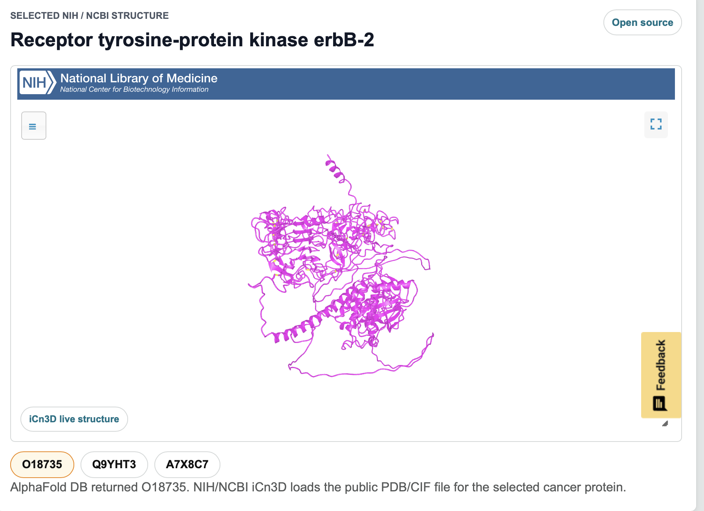
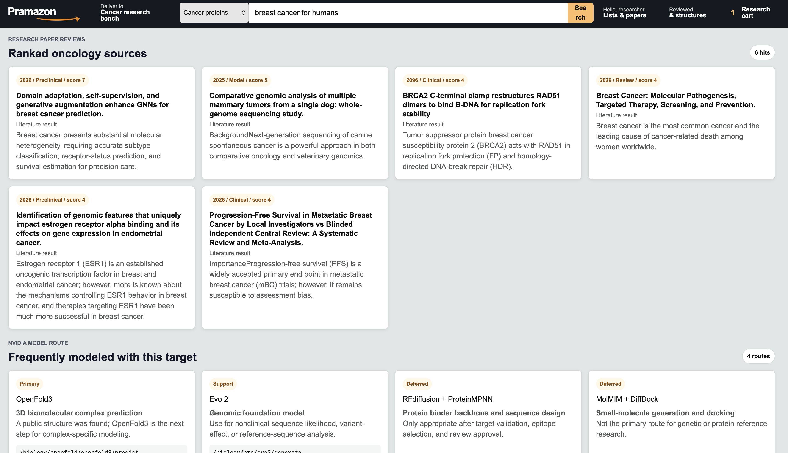

# Pramazon

Pramazon is a cancer-only AI protein research marketplace built for a healthcare
hackathon. A user types a cancer research prompt, and the app turns it into
oncology terminology, live literature results, accession-backed protein cards,
NIH/NCBI iCn3D structure previews, and a copyable research packet.

[Live demo](https://helix-triage.nxlck0.chatgpt.site)

## Screenshots

The first screen behaves like a research marketplace: search a cancer problem,
review protein candidates, inspect source papers, and add proteins to a
research cart.



The structure viewer embeds NIH/NCBI iCn3D so public PDB/CIF structure files can
be inspected directly in the app.



The evidence section keeps the literature and model-routing context visible, so
users can see why a protein was selected.



## What It Does

- Accepts cancer-focused prompts such as `blood cancer for human`,
  `skin cancer for my dog`, or `breast cancer for humans`.
- Normalizes the prompt into oncology terminology with an LLM when
  `OPENAI_API_KEY` is configured.
- Searches trusted biomedical sources for recent literature, accession records,
  and public structure files.
- Displays proteins as research cards with accession IDs, source links, paper
  summaries, usefulness notes, and iCn3D previews when structures exist.
- Produces a research packet while withholding unvalidated therapeutic sequence
  output.

## How The Pipeline Works

`POST /api/research` runs the backend workflow:

1. Reject non-cancer prompts before retrieval.
2. Ask an LLM to plan species, condition, intent, target genes, evidence
   questions, source strategy, and search terms.
3. Search Europe PMC for cancer literature and merge duplicate results.
4. Search UniProt and NCBI Protein for accession-linked reference records.
5. Check AlphaFold DB for public PDB/CIF files that can open in NCBI iCn3D.
6. Ask the LLM to synthesize the retrieved evidence into protein summaries and
   a research packet.
7. Route the request to the most relevant NVIDIA BioNeMo/NIM-style model path.
8. Cache completed research runs in D1 for explicit cache reuse.

If no OpenAI key is configured, the app still runs deterministic cancer planning
and live public-source lookups.

## Safety Boundary

This is a nonclinical research interface. It does not emit novel therapeutic
DNA, RNA, viral-vector, or protein sequences. It can return public accession
IDs, source links, PDB/CIF structure links, and model-routing scaffolds.

Any real therapeutic design, synthesis, animal use, or clinical decision would
require qualified oncology review, target validation, biosafety approval,
provenance tracking, and assay evidence.

## Tech Stack

- Next.js / React
- Vinext and Cloudflare-compatible worker output
- D1-backed research-run cache
- Europe PMC, NCBI E-utilities, UniProt, and AlphaFold DB lookups
- NIH/NCBI iCn3D embedded structure viewer
- Optional OpenAI LLM planning and synthesis

## Run Locally

```bash
npm install
npm run dev
```

Useful validation commands:

```bash
npm run build
npm test
npm run lint
```

## Environment

Copy `.env.example` and configure only the values you need:

```bash
OPENAI_API_KEY=
OPENAI_MODEL=gpt-5-mini
OPENAI_BASE_URL=https://api.openai.com/v1
OPENAI_ENABLE_WEB_SEARCH=true
OPENAI_WEB_SEARCH_TOOL=web_search
```

`OPENAI_API_KEY` enables the LLM planner and synthesis pass. The public
literature, accession, and structure lookups can still run without it.

## Project Map

- `app/page.tsx` - main Pramazon UI.
- `app/api/research/route.ts` - cancer prompt normalization, source lookup,
  synthesis, and model routing.
- `app/lib/research-types.ts` - shared research result types.
- `db/schema.ts` - D1 research-run cache schema.
- `tests/rendered-html.test.mjs` - build and rendered-output checks.
- `docs/screenshots/` - GitHub README screenshots.
